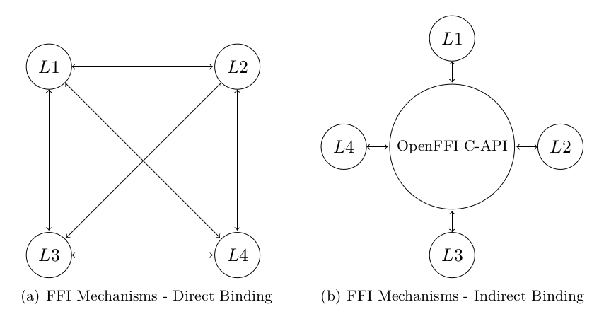

# OpenFFI Framework

**Latest Version: 0.0.3**

OpenFFI framework is a simple and easy way to call functions in different programming languages.

Jump to:
* [Usage section](#usage)
* [Download section](#download)
 

## Do you need OpenFFI?
* Are you tired of searching for that library only in your project's language?

* The library you're looking for is available only in a different language?

* Don't want to settle for a library port and use the real thing???

* Are you really going re-write this code just because it's in a different language than your project?!

* Tired of *language interop hell* to connect different languages in your project?

**WORRY NO MORE - *OpenFFI* is exactly what you need!**


<BR>

OpenFFI Framework provides an easy, simple and straightforward way to call functions from one programming language to another. The framework hides from the user and encapsulates all the hassle of performing FFI calls ([Foreign Function Interface](https://en.wikipedia.org/wiki/Foreign_function_interface) - calling a function in another language). OpenFFI by itself is **not** an FFI solution, but it inter-connects seamlessly different FFIs to provide a simple, clean, unified mechanism. 

#### World without OpenFFI
For example, I want to call from *Go* to *Python3* and vice-versa.\
Let's see how it looks **without OpenFFI** (there might be other techniques, but none is easy):

__Go &rarr; Python3__:
1. Write a C function exposed to [CGo](https://golang.org/cmd/cgo/) that receives the Python3 function parameters in C data types. The function needs to implement the following using [Python3 C-API](https://docs.python.org/3/c-api/index.html):
    1. Load Python3 runtime
    2. Load Python3 module containing the function of your choice
    3. Convert the parameters in C data types to "Pythonic" data types
    4. Call the Python3 function
    5. Get the return values (can be multiple of them in Python3) from Python runtime
    6. Convert the multiple return values into C data types
    7. Return the multiple return values from the C-function (using a C-struct)
    8. **Handle error & exceptions** in both Python and C and return them instead of the "return values" in case of an error (using the C-struct?)
    9. **Handle multi-threading** in case multiple goroutines are calling the Python function at the same time
    10. Avoid the many pitfalls on the way...
   
2. Write Go function that receives the Pythonic function parameters in Go data types. The function needs to implement the following:
    1. Convert Go data types to C data types. Allocate memory and all other things required for C parameters
    2. call C function implemented in step 1
    3. Receive the returned C-struct
    4. Convert Python multiple return values from C to Go
    5. Free all allocated memory
    6. **Handle errors** returned from C and convert them to Go to return them to the caller
    7. **Handle multi-threading** in case multiple goroutines are calling the Python function at the same time
    8. Avoid the many pitfalls on the way...
   
It is essential to point out that different Pythonic functions require other C functions.

__Python3 &rarr; Go__: \
The other way around is a completely different mechanism:
1. In Go:
    1. Export the function you want to call from Python using CGo (//export comment)
    2. Build Go C-Shared dynamic library (.dll, .so or .dylib) exporting the function in C. In case of multiple return values, CGo generates a C struct to holding them.
2. In Python3:
    1. Using (CTypes)[https://docs.python.org/3.8/library/ctypes.html] load Go's dynamic library
    2. Convert Python data types to CTypes data types
    3. Load Go dynamic library
    4. Load Go exported function (exported in C)
    5. Call exported function and receive CGo generated struct holding multiple return values
    6. Extract return values from C-struct and convert them to Pythonic data types
    7. Free any allocated memory
    8. **Handle errors** returning from Go
    9. Avoid the many pitfalls on the way...

That's it! Easy as rocket science in the stone age! :tired_face:

#### World With OpenFFI
I want to call from *Go* to function `f(params)` *Python3* and vice-versa, but this time with OpenFFI!

__Go &rarr; Python3__:
1. Define your function in Protobuf using a [.proto](https://developers.google.com/protocol-buffers/docs/proto3) file
2. Compile the `.proto` file using OpenFFI is stating you want to call from Go to Python3: `openffi -c --idl myfuncs.proto -t --from go`

That's it!

OpenFFI generated a `myfuncsOpenFFIHost.go` file with an `f(params)` stub to call natively from Go, with Go data types!

__Python3 &rarr; Go__: \
1. Define your function in Protobuf using a [.proto](https://developers.google.com/protocol-buffers/docs/proto3#services) file
2. Compile the `.proto` file using OpenFFI is stating you want to call from Go to Python3: `openffi -c --idl myfuncs.proto -t --from python3`

You're Done!

OpenFFI generated a `myfuncsOpenFFIHost.py` file with an `f(params)` stub to call natively from Python3, with Pythonic data types!

<BR />

**Now, That's easy!**

Detailed examples can be found in the [Tutorials](#tutorials) section


## Terminology for the rest of the readme
* *Foreign function* - The function you want to call in a different language
* *Host language* - The language you're calling from
* *Guest language* - The language you're calling to
* *IDL ([Interface Definition Language](https://en.wikipedia.org/wiki/IDL_(programming_language)))* - File defining the functions you're calling to. Currently, the official supported languages are using `.proto`, Google's Protobuf IDL.

## Usage

### Calling Foreign Function

1. Write IDL (`.proto` for current official languages) defining your function(s):

GoUtils.proto:
```
syntax = "proto3";

// openffi_target_lang: "go"
option go_package = "main";

//--------------------------------------------------------------------
service GoUtils { // openffi_module: "github.com/Masterminds/goutils"
   rpc Initials (initials_params) returns (initials_return);
}
//--------------------------------------------------------------------
message initials_params {
   string input = 1;
}
message initials_return {
   string result = 1;
}
//--------------------------------------------------------------------
```
The `openffi_target_lang` tag states the foreign language OpenFFI should use to call this function.

The `openffi_module` tag tells OpenFFI the name of the module. In case it doesn't exist, it uses "service" name.

2. Run OpenFFI CLI tool to compile `PythonFuncs.proto`: \
`openffi -c --idl GoUtils.proto -f python3 -t`

* `-c` (or `--compile`) - Tells OpenFFI to compile
* `--idl` - State the IDL to compile
* `-f` (or `--from`) - State the language(s) you're calling from
* `-t` (or `--to`) - Tells OpenFFI to generate code that links OpenFFI runtime to the foreign function

3. Use the code!
```
from GoUtilsOpenFFIHost import * # This module contains the Python stub

# call foreign functions via OpenFFI
res = Initials('James Tiberius Kirk')
print(res) # prints 'JTK'
```

### Managing Installed Languages (i.e. Plugins)
OpenFFI comes with 2 languages support:
* Python3
* Go

Plugin management is available using OpenFFI CLI tool with the `-p` (or `--plugin`) switch.

* To list installed plugins:
`openffi -p --list`

To install a plugin:
`openffi -p -i [plugin URL or local path]` \
For example, `openffi -p -i https://github.com/GreenFuze/OpenFFI/releases/download/v0.0.3/openffi-ubuntu-python3.tar.gz`

To remove a plugin run:
`openffi -p -r [plugin]` \
 For example, `openffi -p -r python3`

## Installation

### Prerequisites

Current official languages use Protobuf Compiler for data serialization (detailed in [Data-Type Serialization & Protobuf section](#data-otype-serialization-&-protobuf)). Therefore Google Protobuf need to be installed.

**Notice:** Deployed machines (not for developers) do not need Protobuf compiler. It is just for development needs. `-redist` (TBD!) option in OpenFFI CLI tool will provide you with all the binaries needed for deployment.

* Go support requires `protoc-gen-go`, Protobuf's Go support which can be found [here](https://github.com/golang/protobuf). 

* Python3 support requires `protobuf` python package

### Download
#### Version 0.0.3-alpha
* [Windows - openffi-windows-v0.0.3.zip](https://github.com/GreenFuze/OpenFFI/releases/download/v0.0.3/openffi-windows-v0.0.3.zip)
* [Ubuntu - openffi-ubuntu-v0.0.3.tar.gz](https://github.com/GreenFuze/OpenFFI/releases/download/v0.0.3/openffi-ubuntu-v0.0.3.tar.gz)
* [MacOS - openffi-macos-v0.0.3.tar.gz
](https://github.com/GreenFuze/OpenFFI/releases/download/v0.0.3/openffi-macos-v0.0.3.tar.gz)

### Install
Download OpenFFI for your operating system and run the `install` script. Notice you will need administrative rights to install.
* Linux/Mac - `sudo ./install.sh`
* Windows - In Command Prompt with Administrative rights run `install.bat`

## Official Supported Languages
OpenFFI comes with 2 supported languages:
* Python3
* Go

### Tested Environments
| Operating System | Version |
| :---: | :---: |
| Windows | 10 Pro |
| Ubuntu | 20.04 |
| MacOS | Catalina 10.15 |

| Language | Version |
| :---: | :---: |
| Go | 1.12.17 |
| Python3 | 3.8.2 |

## Build From Source
Detailed in [/build-scripts/README.md](build-scripts/README.MD)

## OpenFFI Internals (in a nutshell)
OpenFFI design is entirely modular, built out of plugins loaded in runtime to support different languages, runtime and serializations.

Each language support is an OpenFFI plugin built out of 2 parts:
1. XLLR - Used during runtime
2. Compiler - Used during compile time

OpenFFI uses in-direct FFI to link the supported languages together. No supported language knows how to call another directly. Instead, OpenFFI uses FFI from C and FFI to C to form a link between two supported languages. This approach allows an OpenFFI plugin implementer to implement only C-FFI to gain function calls to **all** the OpenFFI supported languages.

### Cross-Language Linker Runtime (XLLR)
XLLR links the host language and the foreign language during runtime. It exposes C-API to call an arbitrary function in the requested language.

Once XLLR called, it loads an XLLR-plugin which handles the requested guest language and passes the call to it. The plugin handles the actual call.

It is the XLLR plugin that implements foreign language runtime management.\
For example, while the official *Python3* plugin uses the stock Python3 which uses CPython, another implementer can make a *Pypy3* plugin that uses Pypy engine instead of CPython. Users will be able to install the new plugin using the `openffi -p -i [URL]` command. 

### Compiler
The OpenFFI compiler has 3 roles:
1. Generate stub for the foreign function in the host language
2. Serialize/Deserialize parameters (official plugins use Google Protobuf)
3. Use C-FFI library to call to/from XLLR in host/guest languages

It is the compiler plugin that chooses the C-FFI mechanism used or the otype of parameter serialization.

For example, the official *Python3* plugin uses CTypes for C-FFI and Protobuf serialization with `.proto` IDL. Another implementer can make *FasterPython3* plugin that uses "cffi" to C-FFI and FlatBuffers for serialization with its IDL. 
 

### OpenFFI In-Direct FFI Star-Graph vs Common Direct FFI Clique-Graph
FFI libraries provide direct linking from language L1 to L2, this forces developers to learn, maintain and understand multiple libraries. Just a few well-known examples are:
* Python CTypes: FFI Python → C
* JNI: JAVA → C
* CGo: Go → C
* Boost.Python: C++ → Python
* P/Invoke: CRL → C

From the above, we understand that when Go users wish to call a Python function, they need to learn how to use CGo and how to call C.
Next, the developer needs to write a C module to connect to Python, either by loading Python or using another FFI library like Boost.Python. The level of expertise and overhead to cross-linking Go to Python is enormous, which many times raises the dilemma if calling Python in the first place justifies the effort, or porting the Python code is more effortless. This problem worsens when multiple languages are involved.\
In the general case, if a developer wishes to use N languages:
1. In the worst case, as we can see in the figure below in (a) when all n languages are calling each other, n(n − 1) different FFI mechanisms are required for the developer to learn and maintain. The edges in the graph (a) describe the FFI libraries connecting 2 languages represented by nodes. The graph shows that links between all languages form a clique, meaning, it requires n(n − 1).
2. Multiple libraries & APIs - hard to learn, understand, maintain and requires high development effort. As if things are not complicated enough, it is tough to build IDEs and static-analysis tools, which are so in need, to so many different, not understand-able libraries.



In OpenFFI, we are taking a different approach, instead of cross-linking the two languages directly, we are cross-linking them indirectly via XLLR (Cross-Language Linker Runtime), which is a C++ library with C-interface. XLLR acts as a coordinator between the different languages. Thus a language needs to link only to XLLR, and through it, it is linked indirectly to all other languages. By doing so, we accomplish two goals:
1. Single library & API - Simple to learn, understand and maintain. One usage for all cross-language calls.
2. In the worst case, when N languages are calling each other via OpenFFI, the calling graph between all languages forms a star (graph (b)), meaning, it requires an XLLR language implementer to use FFI to/from C.
To add support for Java, the implementer doesn't need to know anything about other OpenFFI supported languages. In total, for N languages, only 2N links to the XLLR are required. Notice that an OpenFFI user uses all different links to all other languages by calling a stub in host language that indirectly calls the guest language foreign function.

### Parameters Serialization
One of the complex challenges of calling a foreign function is modelling the data types of a foreign language into the host language. OpenFFI takes a different approach by serializing the parameters and the result values into a stream of bytes, which both languages can deserialize into their native data types. In other words, OpenFFI aims to create an ideal "common data types" by leveraging well-known serialization, such as Google Protobuf.

As there is no real "common data types" (unfortunately) that are native in many languages, the serialization that uses native data types are used to *convert* from host language data types to guest language data types and vice-versa.

### Generated Files By OpenFFI Compiler
OpenFFI compiler plugins generate files to support the OpenFFI XLLR runtime to perform the successful cross-language call.

* Code in host language with the following goals:
    * Stubs in the host language with data types of the host language
    * Serialization of the parameters
    * Calling XLLR stating the plugin to be used (i.e. *Python3* or *Go*) and module the foreign function(s) are in
    * Receive serialized return value of the function. In case of error, return an error or throw an exception
    * Deserialize the return value to host language data types
    * Return result 

* Executable code in a guest language with the following goals:
    * Stub to be called from XLLR using FFI passing serialized parameters
    * If applicable, loading of a module containing foreign function(s)
    * Deserialize parameters to guest language data types
    * Call foreign function and receive return values
    * Serialize return values or handle error
    * return "Serialized return values" or error
    
* Serialization code and native data types in the host and guest languages
    * Being generated by executing the serialization code compiler (e.g. `protoc`)

## Tutorials
### Examples
Detailed examples can be found in [examples](../Tests/examples/README.md) directory.

### Add New Language Support (Implement OpenFFI plugin)
Every plugin is built out of 2 components:
1. XLLR - implements `xllr_plugin_interface`
2. Compiler - implements `compiler_plugin_interface`

The *example* plugin ([example XLLR](XLLR/example/README.md) & [example Compiler](CLI/example/README.md)) written in C++, contains the least amount of code for plugin implementation and can be used as a template for implementers. The README.md details what is required to build OpenFFI plugin.

The *Python3* plugin ([python3 XLLR](XLLR/python3/README.md) & [python3 Compiler](CLI/python3/README.md)) and *Go* plugin ([go XLLR](../plugin-go/runtime/README.md) & [go Compiler](../plugin-go/compiler/README.md)) contain details about their implementations and can be used as a basis for new plugin.
